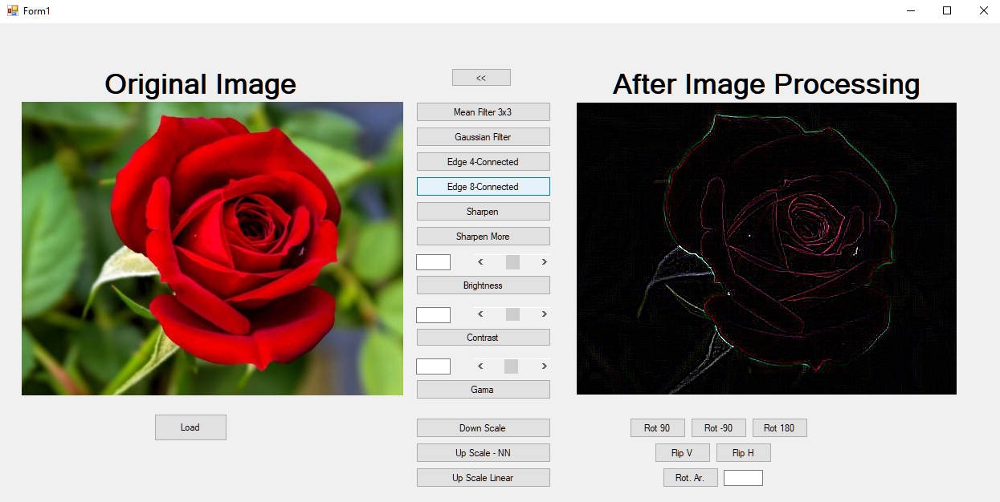
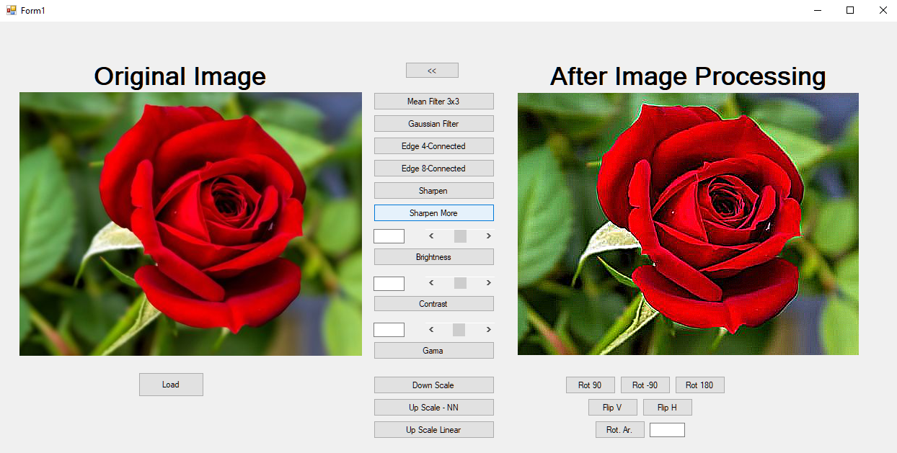
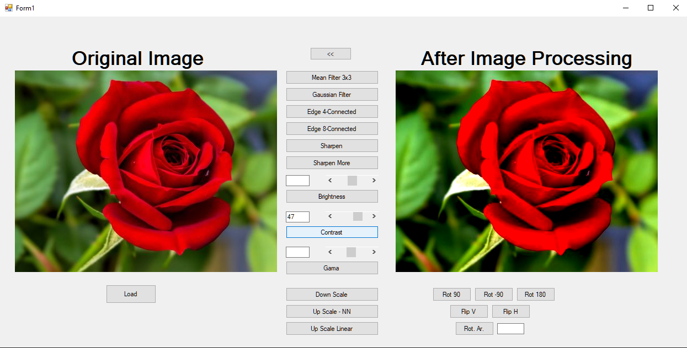
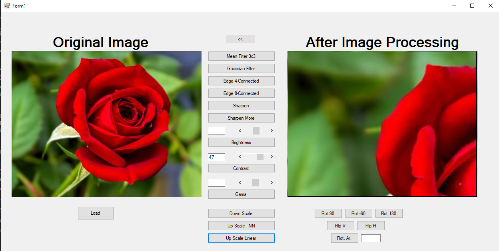
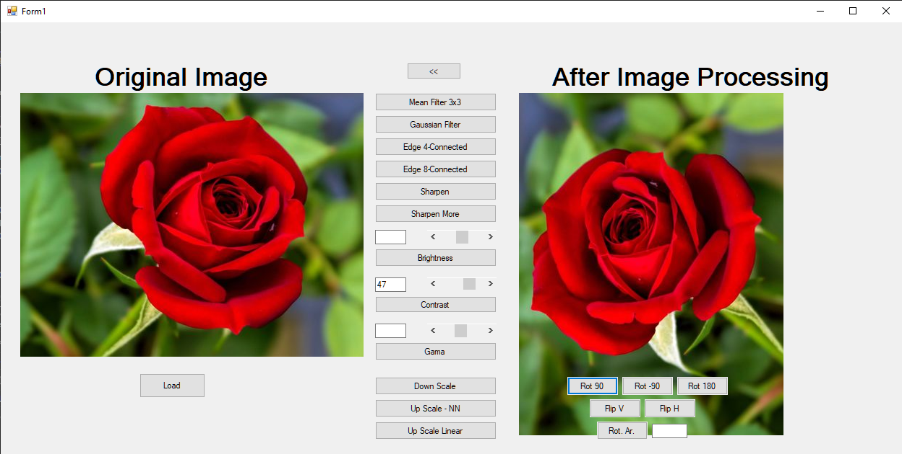
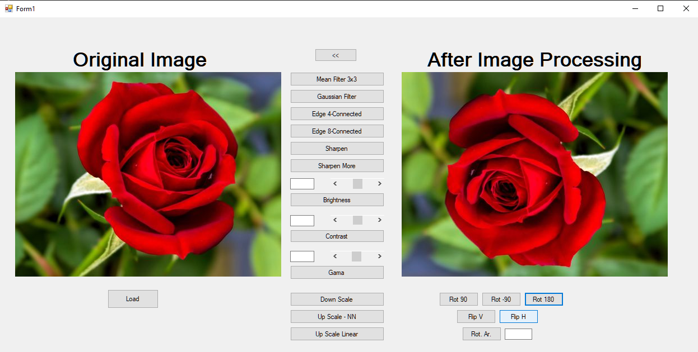
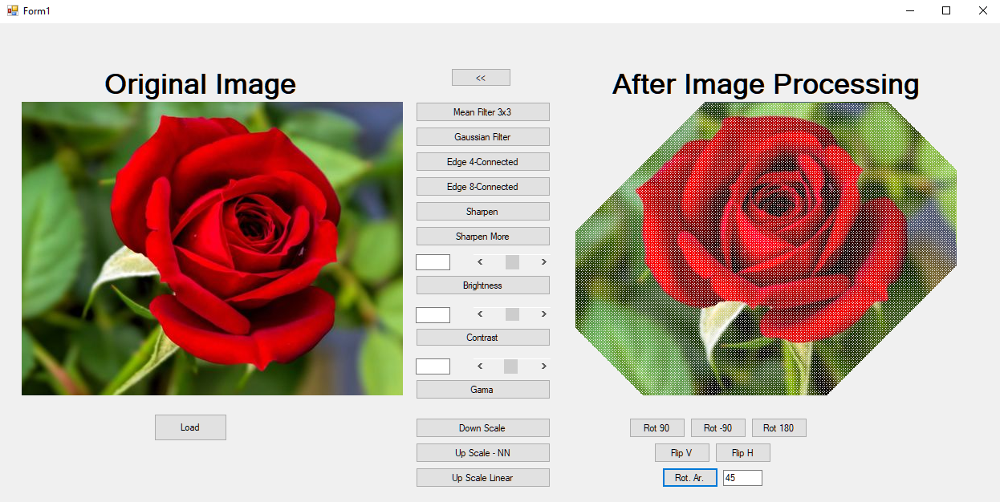

# Image Processing Application

You can apply image processing methods to the input image. 
<u>**Filters:**</u>

- Mean Filter
- Gaussian Filter

<u>**Edge Detection:**</u>

- Laplacian 4-Connected
- Laplacian 8-Connected

<u>**Color Settings:**</u>

- Sharpen
- More Sharpen
- Brightness
- Contrast
- Gama

<u>**Image Scaling:**</u>

- Down Scale
- Up Scale - NN
- Up Scale Linear

<u>**Image Rotation**</u>

- Rotate 90&deg;
- Rotate -90&deg;
- Rotate 180&deg;
- Rotate Arbitrary
- Flip Vertical
- Flip Horizontal

